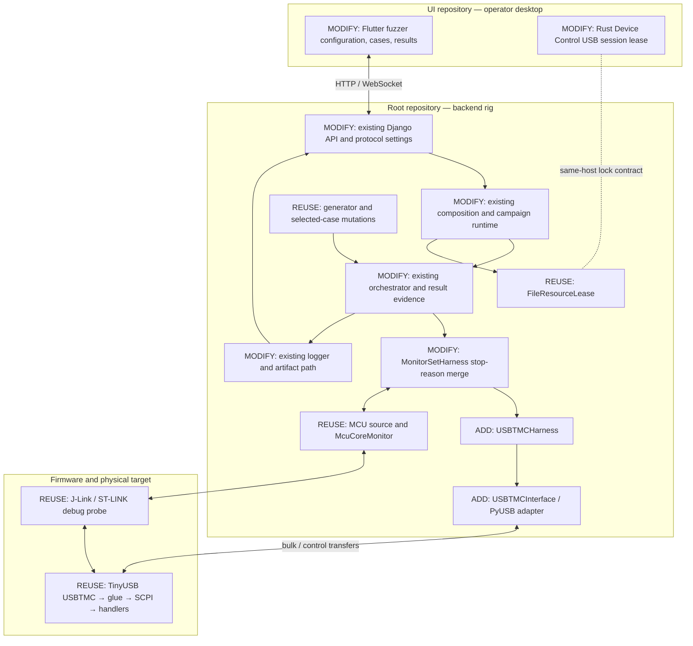

# USBTMC fuzzing through the existing IoTSploit application

Status: **Implemented on `feat/usbtmc-fuzzing` in root, UI, and firmware repositories.**  
Date: 2026-09-30  
Visual companion: [architecture and component diagram](usbtmc-fuzzing-plan.html)  
Initial review: `feat/jtag-core-monitor` in root and UI.  
Latest checked workspace: root `dev` at `eb988b81`; UI `dev` at `e526f30`.  
Firmware reference: `ui/third_party/iotsploit-usb`, `main`, `982385f` during the original review.

This Markdown document records the implementation plan and its delivery. It refines the earlier HTML proposal using additional owner inspection. Recheck revisions and working-tree state before implementation; do not switch branches or overwrite unrelated work to match these snapshots.

## 1. Objective and success criteria

Add `usbtmc` to the existing IoT Fuzzer application so an operator can:

1. Select a USBTMC interface attached to the backend rig.
2. Verify normal communication and, optionally, an independent MCU monitor.
3. Mutate SCPI commands and binary blocks using the existing generator or selected-case engine.
4. Execute USBTMC message and control-request sequences, including malformed raw frames.
5. Distinguish expected protocol rejection, protocol unavailability and observed MCU failures.
6. Inspect exact wire operations and monitor evidence in existing results views.
7. Replay a saved case through the same harness without generating another mutation.

Completion requires real hardware execution, correct configuration persistence, exclusive interface ownership, reproducible artifacts, and continued operation of existing protocols. A mock campaign or a passing host test does not satisfy hardware acceptance.

## 2. Verified current behavior

| Owner | Observed behavior | Consequence |
|---|---|---|
| `iot_protocol_runtime.py` | Real harness construction handles CAN, UART and SPI. | USBTMC needs an explicit construction path. |
| Same runtime | Initialization errors fall back to mock execution unless a monitor plan is configured. | USBTMC must require real execution even without an MCU monitor. |
| `ProtocolHarness.execute()` | Accepts one `bytes` payload and returns `HarnessResult`. | Keep this contract; configure the operation scaffold separately. |
| `SelectedCaseGenerator` | Feeds field-based mutations into the existing execution loop. | Reuse for mutable SCPI/header regions. |
| `MonitorSetHarness` | Samples before/after and merges monitor verdicts with the inner result. | Reuse the wrapper; preserve protocol failure decisions during merging. |
| Same wrapper | Replaces `result.stop_reason` with a monitor stop or `None`. | A healthy monitor can currently erase an inner harness stop; fix this owner. |
| `TestLogger` | Stores payloads by content hash; campaign JSONL is written when monitor verdicts exist. | Protocol evidence must also be retained without MCU monitoring. |
| Configuration save view | Extracts `device_path`, `baud_rate` and `timeout`. | New USB selector and sequence fields would otherwise be dropped. |
| Django models | Protocol choices omit USBTMC; settings already use JSON fields. | Update choices and generate migration; reuse settings storage. |
| Flutter models/controllers | Enum and configuration assume existing protocol settings. | Add USBTMC, round-trip settings, and audit all protocol switches. |
| Desktop Rust bridge | Uses the firmware repository's Rust host for USBTMC and TCP Device Control. | Keep this feature; coordinate same-host raw USB access with campaign leases. |
| `probe_lock.rs` | Already accepts a resource string and provides shared OS-file locking. | Reuse it; do not create a second lock module. |
| `iot_protocol_adapter.py` | `_get_hardcoded_protocols()` returns `self.supported_protocols`. | This is not a second independent metadata declaration. No duplicate-registry deletion is justified. |
| Django dependencies | Already declare PyUSB. | Add an optional fuzzer extra for standalone transport use; check installed backend availability separately. |

## 3. Approach decision

| Criterion | Python raw USB adapter | Desktop Rust campaign executor | Native C fuzz target |
|---|---|---|---|
| Main purpose | Real rig USBTMC campaigns | Execute through desktop Device Control | Fast parser/glue fuzzing |
| Existing campaign integration | Direct | Requires a new desktop/backend execution connection | Separate campaign integration |
| Malformed framing | Exact raw bulk/control operations | Existing normal host API builds framing; would need extensions | Parser/glue entry points, not physical USB |
| MCU monitor integration | Existing wrapper and backend services | Cross-process/cross-host coordination | Independent of real MCU monitor |
| New owners | One interface, one harness | Execution coordination plus transport changes | Small native harness/build target |
| Dependency impact | Optional PyUSB extra; rig USB backend | Existing Rust host plus new coordination | Sanitizer/compiler tooling |
| Maintenance | Fits current Python protocol layout | Adds a second campaign execution location | Useful complementary workflow |
| Decision | **Recommended for this plan** | Keep for desktop Device Control | Deferred complementary work |

Implement valid SCPI-over-USBTMC first, then raw framing and sequences in the same owners. Do not build a new campaign engine, generic USB framework, sequence DSL, protocol registry, or monitor kind that opens the campaign's USB connection again.

## 4. Architecture and dependency boundaries



Ownership rules:

- **Interface adapter:** device/interface discovery, USB handles, claiming, actual transfers, transfer errors and release.
- **Harness:** USBTMC framing, sequence interpretation, response validation, synchronization expectations, protocol outcome and transcript.
- **MCU monitor:** debug state, persistent fault judgement and existing snapshots; no USB transport judgement.
- **Composition root:** choose adapter and lease implementation, supply them to runtime; core never imports PyUSB, Django or OS USB libraries.
- **Runtime:** campaign lifecycle, hardware ownership and cleanup; use the current execution loop.
- **Logger:** artifact persistence and attribution; use existing content-hashed payload storage.
- **Flutter:** select rig hardware and configure execution through backend APIs.

The fuzzer remains independent of `iotsploit-core` and Django. Put the concrete USB adapter in the existing fuzzer `interfaces/` layout. The application composition root supplies that adapter and manages the existing lease; do not add a new core USB port with no current consumer.

## 5. Scope and initial operating policy

### Included

- Linux rig discovery and execution.
- One USBTMC interface per campaign.
- SCPI commands, binary blocks and explicitly configured reply expectations.
- Raw USBTMC bulk frames and specific class clear/abort sequences in the later phase.
- Existing mutation engines, campaign controls and optional existing MCU monitors.
- Transcript persistence, protocol classification and exact logical replay.
- Same-host Python/Rust USBTMC session contention handling.

### Deferred

- Firmware coverage instrumentation and coverage-guided hardware scheduling.
- Windows/macOS hardware qualification.
- ESP32-S3 debug monitoring; current monitor targets are Cortex-M.
- Automatic board power cycling and automatic reconnect/recovery loops.
- Arbitrary USB descriptor/control fuzzing outside the selected USBTMC interface.
- Continuous monitoring inside every sequence operation.
- Native C sanitizer fuzzing integration, except as a later complementary task.

Initial MCU recovery policy is `stop`. A protocol failure also stops when target usability cannot be established. No implicit clear, reply draining, USB reset or MCU reset occurs before preserving evidence. A clear/abort inside a test is an explicit stimulus and is recorded as such.

## 6. Component inventory: add, modify, remove, reuse

Paths are relative to the root checkout. Abbreviated prefixes in tables are expanded below:

- `F/` = `iotsploit-fuzzer/src/iotsploit_fuzzer/`
- `D/` = `iotsploit-django/src/iotsploit_django/`
- `UI/` = `ui/lib/screens/iot_fuzzer/`

### 6.1 Additions

| Proposed file | Purpose | Why a new file is justified |
|---|---|---|
| `F/interfaces/usbtmc_interface.py` | Discovery, interface claim, bulk/control I/O and close | Existing interface owners handle different physical transports. |
| `F/harnesses/usbtmc_harness.py` | Framing, responses, ordered steps, canaries and replay | Existing harnesses handle different protocols; keep small codec helpers here initially. |
| `D/migrations/<next>_usbtmc_protocol_choices.py` | Migration for changed protocol field choices | Django model state must match code. Generate rather than guess number/operations. |
| `iotsploit-fuzzer/tests/test_usbtmc_harness.py` | Minimal high-risk framing, sequence and outcome coverage | No existing USBTMC harness coverage exists. Read testing policy before adding. |

Do not add a new discovery service, lock module, artifact database, sequence generator or MCU monitor implementation. Additional files require an implementation-time demonstration that the current owners cannot hold the behavior cleanly.

### 6.2 Modifications

| Owner | Required work |
|---|---|
| `iotsploit-fuzzer/pyproject.toml` | Optional PyUSB dependency, `usbtmc` extra and aggregate extra. Check root installation and update Poetry lock only if required. |
| `D/composition_root/core_container.py` and existing wiring if needed | Supply USB adapter and existing resource lease to runtime; keep optional imports from breaking unrelated protocols. |
| `D/tools/iot_protocol_runtime.py` | USBTMC construction, SCPI seeds, required-real execution, configured scaffold and lifecycle cleanup. |
| `D/tools/iot_protocol_adapter.py` | Add protocol metadata, settings validation, compatibility and USBTMC interface-adapter selection. |
| `D/tools/iot_protocol_components.py` | Connection-test adapter using the same construction path as actual execution. |
| `D/tools/iot_fuzzer_service.py` | Audit and extend existing protocol validation, frame/template dispatch and configuration serialization where USBTMC currently falls through. |
| `D/iot_fuzzer/views_configuration.py` | Save/load validated USB settings and expose rig discovery through current protocol metadata. |
| `D/iot_fuzzer/views_management.py` | Preserve selected case settings; avoid CAN/UART defaults for USBTMC; extend templates through their existing owner. |
| `D/adapters/django/iot_fuzzer/models.py` | Add protocol choice; reuse settings JSON storage. |
| `F/harnesses/base.py` | One optional bounded JSON-compatible evidence field on `HarnessResult`. |
| `F/harnesses/monitor_set_harness.py` | Preserve the inner harness's stop reason when monitor verdicts are healthy; define precedence when both request a stop. |
| `F/core/orchestrator.py` | Correct USBTMC identity, evidence in completion events, replay through existing execution. Do not add another loop. |
| `F/analysis/logger.py` | Persist protocol evidence without MCU verdicts; retain existing payload hashes; write campaign manifest and transcript attribution. |
| `UI/models/fuzzer_enums.dart` | Add USBTMC and audit exhaustive switches. |
| `UI/models/config_models.dart` | Round-trip USB identity, interface, limits, mode and scaffold through existing model. |
| `ui/lib/services/iot_fuzzer/configuration_api_service.dart` | Map API keys and live rig choices; preserve save/load. |
| `UI/controllers/config_controller.dart` and `test_controller.dart` | Device selection, defaults appropriate to USB, true USBTMC campaign assembly and setup errors. |
| `UI/pages/configuration_page.dart` | Device picker, mode and relevant limits; reuse showcased components. |
| `UI/widgets/management_cases_panel.dart` and existing case editor owners | SCPI/header byte fields, templates and sequence settings. |
| `UI/widgets/test_execution_table.dart` and existing results models/widgets | Protocol outcome versus MCU evidence; ordered transcript inspection and replay action. |
| `ui/rust/src/api/usbtmc.rs` | Take the shared USBTMC interface lease before raw USB open; release on session drop/failed open. Do not apply a USB lease to TCP sessions. |
| `ui/rust/src/probe_lock.rs` | Only identity/key documentation or helper changes proven necessary; generic resource locking already exists. |
| Existing tests, contract route snapshots if changed, README owners | Minimal integration validation and user instructions; no duplicated test suites. |

### 6.3 Removals and replacements

- Remove the route from failed USBTMC initialization into mock execution. Implement this in the current fallback owner using protocol configuration, not a speculative initialization flag.
- Replace the monitor wrapper's loss of inner `stop_reason` with a merge that preserves a protocol stop. Retain both sources in evidence when both fail.
- Do **not** delete protocol declarations based on the earlier HTML's conditional duplication suggestion: the checked accessor already returns the shared mapping.
- No whole file, existing protocol, existing monitor or desktop Device Control API is scheduled for deletion.
- Remove imports/comments made unused by actual in-scope implementation.

### 6.4 Reuse without redesign

Reuse `RadamsaGenerator`, `SelectedCaseGenerator`, field mutation, `frame_data_from_fields`, monitor source/policy contracts, `MonitorService`, `FileResourceLease`, existing campaign APIs/events and current artifact browsing.

Use USB Explorer's identity/display conventions and Rust host framing as references. Do not import a driver's private discovery helpers into the fuzzer or claim that generic USB enumeration already implements USBTMC endpoint selection.

No initial firmware change is required. Later findings determine whether the owning fix belongs in TinyUSB, `glue/usbscpi_tinyusb.c`, `src/usbscpi.c` or an application handler.

## 7. Device discovery and exclusive ownership

### 7.1 Discovery contract

1. Enumerate rig devices and inspect interface descriptors for USBTMC class/subclass.
2. Report selectable interface identity: VID, PID, serial when readable, bus/address, port topology when available, interface number, alternate setting and endpoint descriptors.
3. Derive bulk endpoints from the selected interface; do not hardcode board endpoint numbers.
4. Discovery must not silently claim an interface, issue SCPI commands, detach drivers or clear endpoint state.
5. If serial strings are unreadable, show that fact and use available topology to distinguish candidates.
6. Never select the first VID/PID match silently. Require exactly one verified selection at open.
7. Extend current protocol metadata with rig choices first; add a route only if the existing endpoint cannot express discovery cleanly.

### 7.2 Resource key

Agree on Python/Rust key vectors before implementation. Include physical device identity and interface; preserve arbitrary device serial semantics. Do not automatically apply J-Link's numeric leading-zero normalization to every USBTMC serial.

The earlier example `usb:1209-DEVICE_SERIAL/usbtmc-if0` is illustrative, not a frozen key contract. Resolve PID disambiguation, serial escaping and lock-filename collision behavior before accepting final vectors. Extend an existing identity owner only if needed; do not introduce a parallel identity subsystem.

Without a unique serial, use stable rig topology plus interface where available. Bus/address is an open-time locator, not permanent identity. If identity cannot be verified after reconnect, stop and require reselection.

### 7.3 Lifecycle

1. Validate configuration before opening hardware.
2. Resolve selection and build the resource key.
3. Acquire USBTMC lease before claiming the interface.
4. Claim only the chosen interface; preserve a composite device's vendor-log interface.
5. Track whether this session detached an OS driver; restore only that driver's ownership during cleanup where supported.
6. Hold lease throughout connection tests or campaign lifetime.
7. Release USB handle, restore driver when applicable and release lease on every exit path.
8. Existing monitor service independently manages the debug lease. If either setup fails, release already acquired resources.

Same-host desktop raw USB sessions must honor the same key before the first backend hardware release. Local lock files do not coordinate different hosts, different users' lock directories or external programs that ignore the contract; document this practical limit.

## 8. Proposed configuration contract

Names and defaults below are proposed. Validate them against the existing API conventions in Phase 0 and keep one normalized backend representation.

```json
{
  "protocol_config": {
    "protocol_type": "usbtmc",
    "mode": "scpi",
    "device": {
      "vid": 4617,
      "pid": 1,
      "serial": "DEVICE_SERIAL",
      "interface": 0,
      "alternate_setting": 0
    },
    "timeout": 1000,
    "max_response_bytes": 4096,
    "case_deadline_ms": 5000,
    "baseline_query": "*IDN?",
    "sequence": [
      {"op": "write_message", "data": "$payload", "eom": true},
      {"op": "request_read", "max_bytes": 4096}
    ]
  },
  "monitors": [
    {
      "kind": "mcu_core",
      "name": "mcu_core:main",
      "resource": "usb:0483-PROBE_SERIAL/debug",
      "target": "STM32F407VG",
      "options": {"recovery_policy": "stop", "settle_ms": 20}
    }
  ]
}
```

VID/PID, serial and probe values are placeholders. Endpoint addresses are descriptor-derived. `timeout` retains the current millisecond convention; clarify units in the UI and normalization owner.

Validate device selector types/ranges, mode choices, interface selection, nonzero finite timeouts, response cap, total deadline, operation count and cumulative delay. Preserve validated settings through API → model JSON → saved configuration → UI → campaign construction. Do not reinterpret USB identity as `device_path`, baud rate or a CAN interface.

## 9. Harness and mutation behavior

### 9.1 SCPI mode

- `execute(payload: bytes)` receives the mutant; a validated sequence scaffold comes from case/campaign settings.
- Construct valid USBTMC command framing around those bytes, preserving explicit EOM and fragmentation settings.
- Query sequences include a response request. Non-query sequences may legitimately have no reply.
- Do not blindly append a newline to every mutant: missing terminators are valid test variations; seed templates supply intended termination.
- Handle arbitrary binary data without UTF-8 decoding of wire blocks.
- Seeds include valid identity/error queries, application commands and definite-length binary blocks.
- Avoid default CAN seeds for USBTMC campaigns.

### 9.2 Raw mode

- Send the selected mutated bulk frame exactly as recorded.
- Do not repair declared lengths, message IDs, tags, inverse tags, reserved bytes, padding or EOM after mutation.
- Mutate one identified byte region initially; use explicit templates for different operation sequences.
- Keep operation scaffold and host limits separate from raw mutable bytes so fuzzed JSON is not rejected before reaching firmware.
- Sequence operations initially cover logical write, raw bulk write, read request/read, bounded delay and specific USBTMC clear/abort class requests.
- Verify USBTMC request recipient, direction, fields, status polling and endpoint behavior from the specification and actual TinyUSB implementation before coding.
- Class clear, endpoint-halt clearing and device reset are distinct; do not substitute one for another.

Keep the existing byte-generator contract. A sequence template should have one designated mutable region for the first version. If selected cases need different scaffolds, preserve the association between each generated mutant and its selected case in the existing generator/runtime owner; never infer case identity solely from identical payload bytes.

### 9.3 Bounds and cancellation

- Limit actual transmitted bytes, response allocation, operation count and delay duration.
- A fuzzed declared length must not become an unbounded host buffer allocation.
- Bound each transfer by the remaining case deadline.
- Check cancellation between operations; a blocked transfer must return within its timeout.
- Keep a transcript of completed operations when a later step fails.
- Protocol validation failures before transmission produce invalid-test outcomes, not firmware coverage or crashes.

## 10. Observations, failure classification and recovery

The current monitor wrapper owns before/after sampling. The USBTMC harness owns protocol checks on the connection it already uses.

| Condition | Outcome | Continue? |
|---|---|---|
| Documented command rejection and usable follow-up communication | Expected rejection | Yes |
| No reply to mutant, valid synchronized canary succeeds | No reply / inconclusive | Yes if template permits |
| No reply while a partial command legitimately awaits completion | Incomplete exchange | Only as specified by template |
| Valid canary fails after explicit synchronization; MCU healthy | Protocol unavailable/failure | Stop |
| Persistent fault or lockup | MCU crash evidence | Stop; existing snapshot |
| Unexpected reset or disconnect | Reset/disconnect evidence | Stop |
| Invalid operation scaffold rejected by host | Invalid test configuration | Do not execute |

Initial policy:

1. Establish baseline identity and MCU health before mutation.
2. Capture before observation, execute sequence, capture after observation.
3. Persist protocol evidence and MCU verdicts before any external recovery.
4. Stop when either owner requests a stop.
5. If both protocol and monitor request a stop, use the existing monitor severity for the displayed primary reason while retaining the inner stop in evidence; healthy monitors must preserve the inner stop unchanged.
6. Recover between campaigns using a separate recorded action, then establish a new baseline.

Explicit clear/abort operations inside a sequence can themselves change evidence. Bracketing samples establish an observation interval, not per-operation causation. Keep short sequences initially; report this limitation rather than promising continuous detection.

Transport timeouts do not set `crashed=True` by themselves. Core faults, host transfer failures, invalid responses and expected SCPI errors remain distinguishable in result evidence and the UI.

## 11. Artifact, event and replay contract

### 11.1 Persistence

Extend `HarnessResult` with one optional bounded JSON-compatible evidence object. Keep protocol-specific structure inside that object rather than adding one generic result field per USB operation.

Persist:

- **Campaign manifest:** normalized settings, selected interface descriptors, initial identity/baseline, firmware revision when known, generator seed, selected templates and root/UI/firmware revisions.
- **Case input:** existing content-hashed mutant bytes plus campaign ID, index and selected-case attribution.
- **Effective sequence:** resolved mutable region, EOM, control fields, requested sizes and configured delays.
- **Transcript:** exact OUT bytes and IN replies; requested versus actual lengths; relative timestamps; endpoint/request identity; errors and timeouts.
- **Outcome:** protocol classification, original inner stop reason, final result fields and monitor verdicts/snapshots.

Payload hash alone is not sequence identity. Preserve effective scaffold and campaign/index attribution even when mutants contain identical bytes. Do not overwrite artifacts from earlier campaigns.

The logger currently writes detailed JSONL when MCU verdicts exist; extend the same owner to write when protocol evidence exists. Do not create a second transcript logger.

Keep full bounded transcripts in artifacts. WebSocket completion events may carry a summary and artifact reference rather than a large full transcript; avoid truncating stored reproduction bytes silently. If a configured evidence cap is exceeded, mark the capture incomplete and do not claim exact replay.

### 11.2 Replay

1. Select an existing saved case and resolve its manifest/sequence.
2. Require explicit target selection; verify device/interface identity.
3. Establish the recorded baseline as closely as the rig supports.
4. Run the same harness with mutation disabled; preserve operation order, exact bytes and configured delays.
5. Record a new attributed replay result without replacing the original finding.
6. Repeat enough to classify a claimed finding as reproducible or flaky; state that physical scheduling may still differ.

Use the existing campaign submission and execution path with an explicit saved-case replay input. Do not create another replay execution loop. Automatic minimization is deferred; manual reduction uses the same harness.

## 12. Phases and acceptance checkpoints

### Phase 0 — Contracts and rig baseline

- [ ] Record current repository revisions and unrelated working-tree changes.
- [x] Read applicable root/UI guidance; read C standards if firmware work becomes necessary.
- [x] Select board, firmware, USB interface and debug probe.
- [x] Verify rig PyUSB/backend access, valid identity query and manual MCU check.
- [x] Record descriptors and known valid raw traffic.
- [x] Agree on Python/Rust identity vectors, lock key and no-serial selection behavior.
- [x] Trace configuration save/load, template dispatch, selected-case association and all Dart enum switches.
- [ ] Confirm required clear/abort semantics from the primary specification and firmware owner.

Exit: known-good rig communication and signed-off concrete contracts; no speculative migration or transport API.

### Phase 1 — Backend valid USBTMC support

- [ ] Add optional dependency and adapter with exact discovery/claim/close.
- [ ] Implement valid command and response framing with bounded transfers.
- [ ] Compose adapter/lease and integrate runtime.
- [x] Add real connection checks and protocol metadata.
- [x] Add model choices and generate migration.
- [x] Preserve validated USB settings; update protocol validation/frame dispatch where required.
- [x] Remove USBTMC mock fallback at its current owner.
- [x] Fix monitor stop-reason merging and retain protocol stop evidence.
- [x] Coordinate same-host desktop raw USB lease before hardware acceptance.
- [ ] Validate failed-open, cancellation, normal close and busy interface behavior.

Exit: backend performs real SCPI queries, records replies, stops correctly and releases hardware on every exit path.

### Phase 2 — Application, mutation and replay

- [x] Add USBTMC enum/settings/device selection to existing UI.
- [x] Round-trip configuration through save/load and campaign assembly.
- [x] Provide SCPI/binary-block seeds in current case management.
- [x] Preserve case/scaffold association in selected mutations.
- [x] Extend result evidence, logger and artifact display without requiring MCU verdicts.
- [x] Separate protocol outcome and MCU evidence in existing result views.
- [x] Add saved-case replay through the current execution path.
- [ ] Render changed screens; inspect missing/busy device, setup-error and replay states.

Exit: operator configures, runs, inspects and replays a real SCPI campaign from the application.

### Phase 3 — Raw framing and USBTMC sequences

- [x] Add exact raw bulk writes and bounded class-request operations.
- [ ] Add header-field and explicit sequence templates.
- [ ] Exercise split commands/EOM, tags, lengths, reserved bytes, padding and read sizes.
- [ ] Exercise clear/abort with partial commands and pending responses.
- [x] Place canaries only after valid explicit synchronization.
- [ ] Replay saved findings with exact bytes/scaffold and verify outcome stability.

Exit: malformed bytes reach firmware unchanged; state-sequence evidence survives storage; findings reproduce or are reported as flaky.

### Phase 4 — Findings and optional native fuzzing

- [ ] Reduce reproducible sequences by deleting steps and shrinking mutable byte regions.
- [x] Identify the failing firmware owner.
- [x] Fix each owner and retain only necessary high-risk regression coverage.
- [x] Run the owning repository's gate and affected hardware checks.
- [ ] Optionally add sanitizer/native parser/glue fuzzing as a separate scoped follow-up.

Exit: accepted bugs have a reproduction, owner, fix and verification evidence. This phase depends on actual findings; do not invent firmware changes to complete a checklist.

## 13. Focused verification and gates

Minimal new coverage is justified for previously uncovered wire framing, resource cleanup, stop propagation and replay. Follow `.agents/standards/testing.md`; extend existing integration coverage wherever possible.

| Check | Required behavior |
|---|---|
| Valid framing and replies | Correct known wire vectors; tag handling, padding, short-read assembly and response caps. |
| Raw mode | Malformed declared lengths/tags remain unchanged; host allocation stays bounded. |
| Sequence execution | Order and mutable region association preserved; cancellation/deadline observed. |
| Result merging | Healthy MCU verdict cannot erase protocol stop; simultaneous failures retain both sources. |
| Ownership | Busy rejection; lease released after failed open/cancel; no unrelated composite interface claimed. |
| Cross-runtime lock | Python holder blocks Rust session and vice versa using final key vectors. |
| Persistence | Config round-trip; transcript exists without MCU monitor; repeated bytes do not collapse different sequences. |
| Replay | Mutation disabled; exact scaffold/bytes restored; original artifacts remain intact. |
| Compatibility | Existing CAN/UART/SPI and monitor workflows keep their results/settings behavior. |
| UI | Explicit rig selection; correct setup errors; readable outcome/transcript and replay flow. |

Required commands when relevant implementation is ready for commit:

```bash
# Root Python gate; run from root
tools/testing/test-python-full.sh

# Focused development checks use Poetry
poetry run pytest iotsploit-fuzzer/tests/test_usbtmc_harness.py

# UI Dart gate; run from ui/
tools/testing/test-flutter-full.sh

# Rust bridge checks; run from ui/rust/
cargo test --lib

# Only if C/build/transport tests change; run from iotsploit-usb/
tools/testing/test-c-full.sh
```

Use the pinned `fvm flutter` toolchain for Flutter commands. New Python tests belong under configured test paths and declare markers. Hardware checks remain outside deterministic commit gates. Report passed/failed/skipped/warning counts, environmental blockers and hardware results separately; do not weaken unrelated checks.

Hardware acceptance scenarios:

1. Known query and valid application command.
2. Unknown SCPI command followed by synchronized valid query.
3. Definite-length block fragmented across messages with intended EOM.
4. Explicit clear/abort sequence during partial input or pending response.
5. Deliberate known MCU fault with existing snapshot evidence.
6. Protocol stall with healthy CPU, classified separately from MCU crash.
7. Stop/cancel then immediate new valid session, proving cleanup.
8. Same-host desktop/backend lease conflict, then success after release.
9. Saved finding replay with mutation disabled and recorded baseline.

## 14. Risks, rollout and remaining decisions

### Risks and practical limits

- Device bus/address changes after reset; identity verification is mandatory before reuse.
- Identical/missing serials need an unambiguous physical selection.
- USB raw APIs control transfer data and class requests, not arbitrary electrical/link-layer timing.
- Debug before/after samples can miss transient conditions within a long sequence.
- Explicit test recovery can change the failure state; transcript and interval attribution must say so.
- Current configuration `coverage_feedback` does not establish real firmware coverage; do not advertise it for this mode without instrumentation.
- OS USB drivers and nonparticipating tools may contend outside the local lease contract.
- Native x86-64 sanitizer results do not prove 32-bit MCU behavior or physical transport behavior.

### Rollout

Enable USBTMC only after real adapter and configuration paths are present; do not expose an enum-only placeholder that launches mock runs. Deliver the SCPI mode first. Expose raw mode after its operations, response handling and artifacts pass Phase 3 acceptance. Keep root/UI commits separate and describe required deployment ordering.

There is no firmware deployment in the initial feature. New model choices use a generated migration; existing saved configurations continue to round-trip. No existing data or unrelated artifacts are deleted.

### Resolve before dependent implementation

| Decision | Proposed default | Resolution checkpoint |
|---|---|---|
| First board/firmware/probe | Existing supported Cortex-M rig | Phase 0 hardware baseline |
| Raw backend | PyUSB with available rig backend | Phase 0 access check |
| Identity/lease normalization | Preserve arbitrary serials; verify cross-runtime vectors | Phase 0 contract |
| Mode/config limits | Values in the proposed JSON; tune against recorded normal traffic | Phase 0/1 |
| Case-specific sequence storage | Existing case/protocol settings, with explicit generated-case association | Phase 0 trace, Phase 2 acceptance |
| Clear/abort capabilities | Only specification-correct operations supported by target firmware | Phase 0/3 |
| Recovery after failure | Stop; separate recorded reset/baseline between campaigns | Initial release |

## 15. References and document refinements

- [HTML diagram and visual inventory](usbtmc-fuzzing-plan.html)
- [Repository architecture](../../architecture.md)
- [Existing target monitor plan](../active/target_monitor_architecture_plan.md)
- [Python testing policy](../../../.agents/standards/testing.md)
- [UI instructions](../../../ui/AGENTS.md)
- [Existing monitor wrapper](../../../iotsploit-fuzzer/src/iotsploit_fuzzer/harnesses/monitor_set_harness.py)
- [Current Rust USBTMC framing](../../../ui/third_party/iotsploit-usb/host/rust/src/usbtmc_raw.rs)
- [Firmware TinyUSB glue](../../../ui/third_party/iotsploit-usb/glue/usbscpi_tinyusb.c)
- [USB-IF document library](https://www.usb.org/documents?search=USBTMC)
- [Official PyUSB tutorial](https://github.com/pyusb/pyusb/blob/master/docs/tutorial.rst)
- [LLVM libFuzzer](https://llvm.org/docs/LibFuzzer.html)

Refinements relative to the earlier HTML: modify monitor stop-reason merging; include service/template dispatch and case association; do not delete already-shared protocol metadata; finalize serial/key semantics before implementation; require same-host desktop leasing before hardware acceptance. These are concrete findings from additional code inspection, not completed code changes.

Only documentation has been requested and created. No application implementation, gate result, hardware campaign, firmware deployment or commit is claimed by this plan.


## 16. Delivered implementation and hardware findings

Branches: `feat/usbtmc-fuzzing` in all three repositories. The original checklist above remains an acceptance inventory; unchecked stress scenarios and optional native fuzzing are follow-up coverage, not claims of completed tests.

| Action | Component | Delivered behavior |
|---|---|---|
| Add | `iotsploit_fuzzer/interfaces/usbtmc_interface.py` | Rig discovery, concrete interface selection, kernel driver release/restore and shared resource lease. Serial identity survives USB address changes. |
| Add | `iotsploit_fuzzer/harnesses/usbtmc_harness.py` | SCPI framing, exact raw writes, read reassembly, explicit clear/abort, bounded deadlines, canary and transcript. |
| Modify | Existing Django configuration, management and runtime owners | USBTMC settings persist; each case retains its sequence; replay uses saved bytes and tags; hardware errors propagate. |
| Modify | Existing result/logging and monitor wrapper | USB evidence survives without a monitor; a healthy MCU does not erase a protocol stop. |
| Modify | Existing Flutter configuration, properties and evidence views | Rig device picker, SCPI/raw mode, JSON sequence editor and exact replay button. |
| Modify | Existing Rust USB session | Takes the same interface lease as Python; TCP sessions retain their existing path. |
| Modify | Firmware `glue/usbscpi_tinyusb.c` | Uses the OUT header's EOM bit, separately from USB transfer completion. |
| Delete | Six board-specific OUT-start callbacks | Their empty implementations are replaced by the shared glue's EOM owner. |
| Reuse | Protocol metadata accessor, campaign loop, generators, MCU monitor and artifact storage | No registry rewrite or second campaign engine. |

### Confirmed EOM bug and fix

Before the fix, sending `*ID` with EOM false and `N?` with EOM true returned only a newline. TinyUSB's data callback reports transfer completion, but the glue passed that value directly as SCPI EOM. The first transfer was parsed prematurely.

The glue now captures `bmTransferAttributes.EOM` in the OUT-start callback and passes `transfer_complete && message_eom` to the core. The callback moved from the board examples into the shared glue. A regression check exercises a split query without a trailing newline, proving that header EOM completes the command.

The STM32F407VG firmware built and was flashed with pyOCD on `10.8.0.14`. After USB passthrough was reattached, the same split query returned `IoTSploit,STM32F4-Disco,0001,0.1.0\n`. Normal queries, raw valid frames and a 1511-byte descriptor response continued to work.

### Validation

- Python gate: 1922 passed, 5 skipped, 44 existing warnings; Ruff and import checks passed.
- Flutter/Rust gate: analyzer clean, 787 Flutter tests passed; desktop Rust 44 passed with one manually enabled interoperability test passing separately.
- Firmware C gate: six reported passes; CAN capture explicitly skipped because `vcan0` is absent (five tests exercised).
- Firmware Rust host: 72 passed. STM32 example built successfully.
- Hardware: IDN, LED state, DATA count, error queue, unknown command, split query, binary block, valid raw frame, multi-packet descriptor, clear and byte-identical replay passed.
- An invalid inverse tag caused a protocol timeout while ST-LINK still reported the MCU running. An explicitly requested clear restored communication.
- Idle abort and an abort after a short IN response returned USBTMC status `0x80`; these are recorded as protocol failures, not MCU crashes. Active transfer abort completion has not been proven by these smoke checks.
- Briefly halting the MCU caused the existing monitor to block transmission. A register snapshot was captured; the MCU was resumed. No deliberate HardFault was injected.
- Two persisted USBTMC cases retained different sequences and executed four mutations through the existing selected-case engine.
- Django save/load and replay ran against an isolated temporary SQLite database and the real board; the live rig application's database was not migrated or replaced.
- Python-held USBTMC lease was refused by the Rust lock implementation. A readable configuration screen was rendered with an unavailable backend to inspect the empty-device/error layout.

### Operator workflow

1. Install the root project's Poetry dependencies and apply the generated Django migration with `poetry run python -m django migrate --settings=iotsploit_django.settings.dev` on the application rig. Standalone fuzzer users install its optional `usbtmc` extra.
2. In IoT Fuzzer Configuration, select USBTMC, refresh rig devices and select the target interface. Test the connection and save.
3. Create a USBTMC group and seed case. The available seed definitions include IDN, a DATA binary block and a raw USBTMC header. Frame fields contain hex bytes; existing mutation strategies produce the payloads.
4. Use the case properties' USBTMC sequence editor for case-specific `mode` and `sequence`. Empty settings inherit the campaign configuration. The rig's USB selector stays campaign-owned.
5. Add the existing `mcu_core` monitor with ST-LINK resource `usb:0483-57FF6C064967485623601087/debug`, target `STM32F407VG`, and recovery policy `stop`.
6. Start the group, inspect saved evidence and use **Replay exact case**. Replay bypasses mutation and verifies the identity baseline. It reproduces wire operations; it does not restore arbitrary application state such as DATA storage or LEDs.

Example split-query sequence (campaign or case settings):

```json
{
  "mode": "scpi",
  "sequence": [
    {"op": "write_message", "data": "2a4944", "eom": false},
    {"op": "write_message", "data": "$payload", "eom": true},
    {"op": "request_read", "max_bytes": 128},
    {"op": "canary"}
  ]
}
```

Use seed `4e3f0a` for the mutable suffix. Raw mode sends the supplied frame unchanged. Keep malformed transfers and synchronization explicit; no automatic recovery is inserted after a failure. JSONL records and a campaign manifest are written through the current logger under `artifacts/` in the runtime working directory. Transfer sizes and operation count bound transcript storage; large transcripts are still included in existing result events.

Remaining coverage: longer mutation runs, active bulk-OUT abort completion, deliberately induced fault snapshots, and full running-application visual checks with live rig discovery. Native sanitizer fuzzing remains the separate optional phase 4 item.
